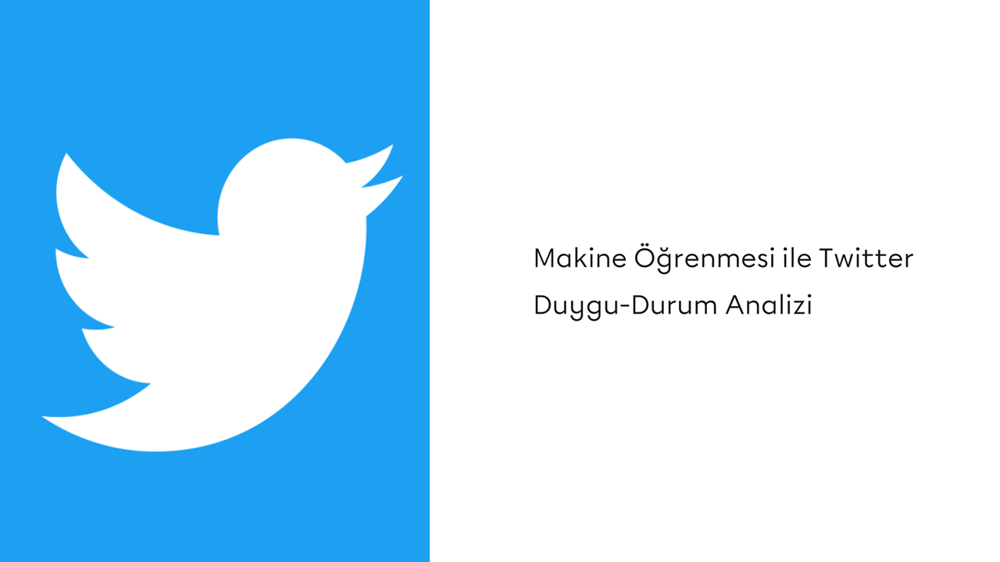

# Twitter-Sentiment-Analysis-with-Machine-Learning

## Business Problem

Predicting the sentiment of tweets posted by Twitter users as positive, negative, or neutral.

## Dataset Story

The **tweet_labeled.csv** dataset contains tweets posted on Twitter in 2022, the dates the tweets were posted, and labels with the values ​​of -1, 0, and 1 for the sentiment in the tweets. The **tweets_2021.csv** dataset includes tweets posted in 2021.

## Features of Dataset

| Dataset            | Total Features | Total Rows | CSV File Size |
|--------------------|----------------|------------|---------------|
| tweets_labeled.csv | 4              | 12.690     | 506.4 KB      |
| tweets_2021.csv    | 3              | 13.272     | 311.2 KB      |

## Variable Descriptions

**tweet_id:** The ID of the tweet 

**tweet:** The content of the tweet

**date:** The date and time when the tweet was posted

**label:** The manually assigned label based on the sentiment of the tweet (-1: negative, 0: neutral, 1: positive)
